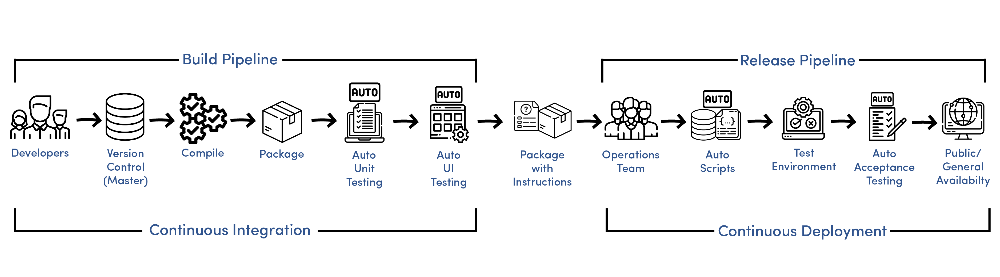

# Jenkins

## CICD

CICD is a process of automating the build and deployment of software. It is a combination of Continuous Integration and Continuous Delivery, which is a part of DevOps. It is beneficial for the business as it helps in reducing the time to market and the cost of the software. It also helps in improving the quality of the software.

### What is Continuous Integration?

Continuous Integration is a software development practice where developers integrate code into a shared repository frequently. Each integration can then be verified by an automated build and automated tests. By doing so, you can detect errors quickly, and locate them more easily.

### What is Continuous Deployment?

Continuous Deployment is a software development practice where code that has been integrated into a shared repository is automatically deployed to a testing or staging environment. By doing so, you can verify whether the software is ready for release. If it is not, you can fix it before releasing it to the production environment.

### What is Continuous Delivery?

Continuous Delivery is a software development practice where code changes are automatically built, tested, and prepared for a release to production. It is a part of the larger DevOps methodology. It is very similar to Continuous Integration, except that it also includes the preparation of the software for release.

### Difference between Continuous Delivery and Continuous Deployment

**Continuous Delivery** and Continuous Deployment are two different practices. Continuous Delivery is where code changes are automatically built, tested, and prepared for **a release** to production.

**Continuous Deployment** takes Continuous Delivery a step further. Every change that passes all stages of your production pipeline is released to your customers. There's no human intervention, and only a failed test will prevent a new change to be deployed to production.

### What is a Webhook?

A webhook is a way for an app to provide other applications with real-time information. A webhook delivers data to other applications as it happens, meaning you get data immediately, rather than having to wait for the other application to poll and gather it.

### What is Jenkins?

Jenkins is an open source automation server which helps in automating the non-human part of the software development process, with continuous integration and facilitating technical aspects of continuous delivery. It is a server-based system running in a servlet container such as Apache Tomcat. It supports SCM tools including AccuRev, CVS, Subversion, Git, Mercurial, Perforce, ClearCase and RTC, and can execute Apache Ant and Apache Maven based projects as well as arbitrary shell scripts and Windows batch commands.

### What is Jenkins Pipeline?

Jenkins Pipeline is a suite of plugins which supports implementing and integrating continuous delivery pipelines into Jenkins. Pipeline provides an extensible set of tools for modeling delivery pipelines “as code” via the Pipeline DSL. The Pipeline plugin was built with performance in mind, and provides features that support scalability and high performance requirements.
